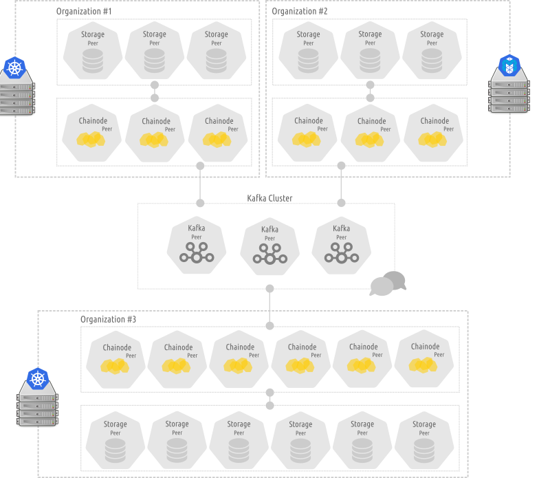

<p align="center">
  <a href="https://github.com/davidemiceli/chainode" target="_blank" rel="noopener noreferrer">
    
  </a>
</p>
<h1 align="center">Chainode</h1>

<h4 align="center"><em>Fast, Highly Scalable, and Lightweight Private Blockchain Network</em></h4>

<p align="center">
  <a href="https://github.com/davidemiceli/chainode/blob/master/LICENSE" target="_blank" rel="noopener noreferrer">
    
  </a>
  <a href="https://github.com/davidemiceli/chainode/pulls" target="_blank" rel="noopener noreferrer">
    
  </a>
</p>

Chainode is a private blockchain designed to be fast, lightweight, and highly scalable. The network allows to exchange data (i.e. transactions) between trusted participants. These transactions are stored as blocks in a distributed ledger.

Chainode is written in pure Javascript for Node.js, and it is based on Kafka as communication system and block order. It is a work in progress.

## Features

The main features are:

- _**Highly scalable**_
  - *Each peer can be deployed, executed, and scaled up and down asynchronously and independently from the others peers. Peers can be runned as containers on different clusters handled by different container orchestrators (like Kubernetes, Mesos, etc).*
- _**Load balancing**_
  - *Designed to support high data volumes, the blocks and the ledger are load balanced: the blocks are distributed between different peers that acts as a single one, sharing the same Kafka group id.*
- _**Resilient**_
  - *Each peer is resistant to failures. If a peer service (or the node where it is running) falls, it can be immediately restarted on another node without (thanks to Kafka retention features) losing data and starting from where he had stopped.*
- _**Message driven**_
  - *The network communication is Kafka based. The peers communicate with each other by exchanging messages asynchronously. Communication can be public or private.*
- _**Fast**_
  - *Every block is propagated to the network and added to the ledger as soon as it was generated (if it was considered valid by the peers), so without any delay or emission at every defined time interval.*
- _**Lightweight**_
  - *A chainode instance (a simple peer) is very lightweight: can be runned on cheap machines (like a Raspberry Pi, so as many docker containers on a single machine).*
- _**REST APIs**_
  - *Every peer exposes web APIs to be handled more easily by other applications.*
- _**Web Console**_
  - *Every peer exposes a Web Console UI for status monitoring, use, and general testing too.*

## How it works

### Participants

Every participant is a network's node that is defined by:

- Blockchain (*the identifier of the blockchain*).
- Organization (*a company, society, club, group, etc., or just an arbitrary identifier to cluster different peers*).
- Role (*the role a node occupies in the network*).

Currently, there are three types of peer node:

- Kafka peers.
- Chainode peers.
- Storage peers.

##### Kafka peers
Kafka peers are mainly communication nodes. There can only be one Kafka cluster for every single blockchain network.

A Kafka peer tasks are:
- Enable communications between chainode peers.
- Keep order of emitted blocks.

##### Chainode peers
Chainode peers are simple chainode instances that propose, receive, and validate new blocks.

A chainode peer tasks are:
- propose new transactions (generate and send new blocks to the Kafka peers).
- validate each block it receives from the Kafka peers.
- communicate with storage peers:
  - to add new validated blocks to the ledger.
  - to retrieve ledger's blocks.

##### Storage peers
The storage peers are distributed database clusters (Couchbase cluster) that holds the ledger.

A storage peer tasks are:
- Keep a local immutable copy of the shared blocks' ledger.

### The network ledger flow
The network steps are the followings:
- A transaction is sent as a new block by a Chainode peer via SDK, REST API, or web console.
- The proposed new block is received by the Kafka peer and placed on the pending topics.
- The other Chainode peers receive the new block, validate it checking if hash is correct, and send the validated block to the Storage peers.
- The Storage peers receive the new block and store it.

## Requirements
Chainode application is based on:
- Apache Kafka v2.1+ (or equivalent Confluent Kafka v4.1.2+)
- Couchbase v6+
- Node.js v10.1+

Chainode Web Console is based on:
- Node.js v10.1+
- Vue.js v2.5.17+
- Bootstrap v4.1.3+
- Webpack v4.27+

## Architecture

The Kafka cluster is shared between organizations, while every organization holds its own cluster of Chainode peers and Storage peers.  
Below there is the architecture of a generic chainode blockchain.

<p align="center">
  
</p>

## Getting started

#### Installation
To install chainode with npm package manager:
```bash
npm install chainode
```

##### Start a peer
To run the chainode peer, the Kafka peers and the Storage peers must be running and available.

Create the Kafka topic (if not exist):
```bash
/confluent/bin/kafka-topics --create --zookeeper localhost:2181 --replication-factor 1 --partitions 3 --topic blockchain.blocks.pending --if-not-exists
```
To start a peer use a configuration file:
```bash
CONFIGS=/app/test/configs/generic.json npm start
```
The configurations can be overwritten like the following examples:
```bash
CONFIGS=/app/test/configs/generic.json BLOCKCHAIN=blockchain PEER_ID=000 DB_HOST=172.25.255.20 WEBUI_PORT=8080 npm start
CONFIGS=/app/test/configs/generic.json BLOCKCHAIN=blockchain PEER_ID=001 DB_HOST=172.25.255.21 WEBUI_PORT=8081 npm start
```

## Configurations
The configurations are loaded by a json file. An example of configuration can be found here: [`test/configs/generic.json`](test/configs/generic.json)

The fields are the followings:

| Field | Optional | Type | Description |
| --- | --- | --- | --- |
| `blockchain` | no | *string* | The name of the blockchain |
| `organization` | no | *string* | The organization to which the peer belongs |
| `role` | no | *enum(peer)* | The role of the peer (currently allowed only "peer") |
| `id` | no | *string* | The id of the peer |
| `db.hosts` | no | *[string]* | The list of database hosts |
| `db.bucket` | no | *string* | Database bucket |
| `db.username` | no | *string* | Database username |
| `db.password` | no | *string* | Database password |
| `kafka.hosts` | no | *[string]* | The list of Kafka broker hosts |
| `kafka.topics.pending` | no | *string* | The name of the topic for the new proposed blocks |
| `kafka.consumer.groupId` | no | *string* | The Kafka consumer group id to use |
| `kafka.consumer.fromOffset` | yes | *boolean* | If set true, Kafka consumer will fetch message from the given offset in the payloads |
| `kafka.consumer.autoCommit` | yes | *boolean* | The consumed messages are acked automatically by the Kafka consumer |
| `kafka.consumer.encoding` | yes | *string* | Kafka message encoding (`utf8`) |
| `kafka.consumer.keyEncoding` | yes | *string* | Kafka key message encoding (`utf8`) |
| `kafka.producer.partitionerType` | yes | *integer* | Partitioner type (default = 0, random = 1, cyclic = 2, keyed = 3, custom = 4), default 0 |
| `webconsole.enabled` | yes | *boolean* | Enable/disable the web console |
| `webconsole.host` | no | *string* | The ip address or the hostname of the web console server |
| `webconsole.port` | yes | *integer* | The web console server port |
| `logs.level` | yes | *enum(debug, info, warn, error)* | The log level to use |
| `logs.console` | yes | *boolean* | To show logs on the console too |
| `logs.path` | no | *string* | The path for .log files |

## REST APIs
Every peer exposes a REST API service. For a detailed documentation, read the [wiki page](https://github.com/davidemiceli/chainode/wiki/RestApis).

## Development and testing

#### Start dockerized environment for testing

At first, is required to start a dockerized environment for testing. To do this, run:
```bash
git clone https://github.com/davidemiceli/chainode.git
cd chainode/
DB=couchbase npm run start-dev-env
docker exec -it nodejs npm install
npm run create-dev-topics
npm run init-db
```
To close the dockerized environment:
```bash
npm run stop-dev-env
```

#### Run unit tests
After dockerized environment is started, run unit tests:
```bash
docker exec -it nodejs npm test
```

#### Manual testing
```bash
docker exec -it nodejs /bin/bash -c "CONFIGS=/app/test/configs/generic.json npm start"
```

#### Web Console
The first time, install all required packages:
```bash
docker exec -it nodejs /bin/bash -c "cd web-console/frontend && npm install"
```
Then, to build the frontend type:

*for development mode*
```bash
docker exec -it nodejs build-webconsole-dev
```
*for production*
```bash
docker exec -it nodejs build-webconsole-prod
```

## License

Chainode is licensed under the terms of the [GNU Affero General Public License Version 3 (AGPL)](LICENSE).  
Documentation is licensed under [CC BY 4.0](http://creativecommons.org/licenses/by/4.0/).
